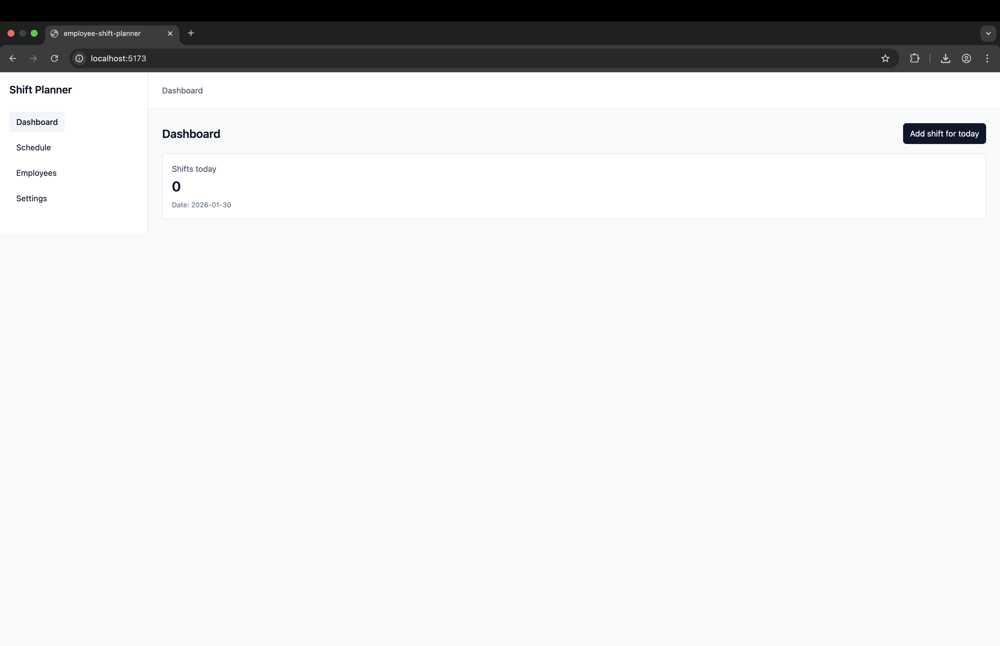
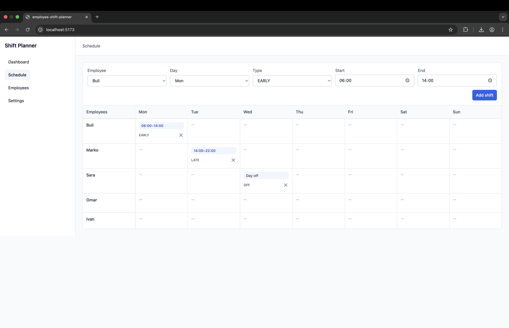
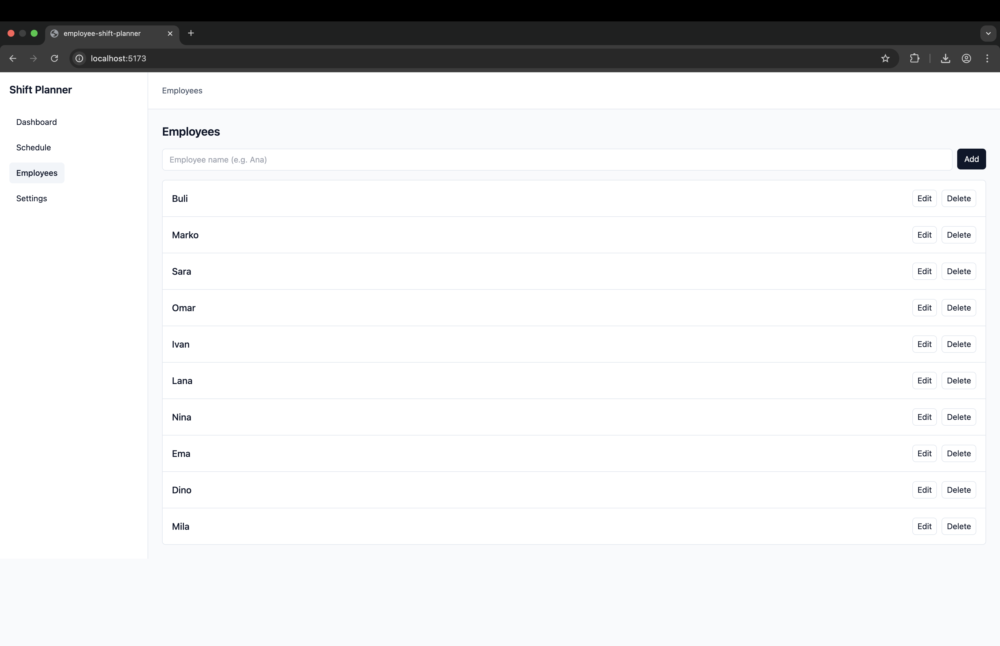
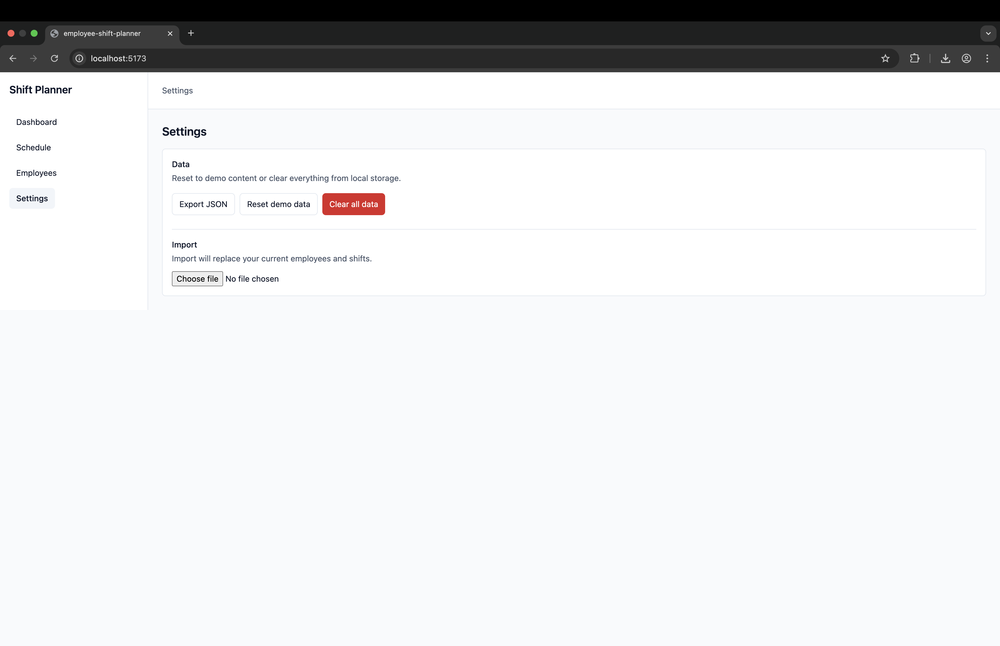

# Employee Shift Planner

A simple employee shift planning application built with React and TypeScript.
The app allows managing employees, assigning weekly shifts, and persisting data in localStorage.

This project was built as a portfolio project to demonstrate real-world React patterns, state management, and data handling.

---

## 📸 Screenshots

### Dashboard



### Schedule



### Employees



### Settings



---

## ✨ Features

- Dashboard with quick actions (Add shift for today)
- Weekly schedule view with sticky header and employee column
- Create, edit and delete shifts
- Employees CRUD (create, edit, delete)
- Automatic removal of shifts when an employee is deleted
- LocalStorage persistence
- Settings page:
  - Reset demo data
  - Clear all data
  - Export / Import data as JSON
- Empty states and basic UX validations

---

## 🛠 Tech Stack

- React
- TypeScript
- Vite
- Tailwind CSS
- LocalStorage (no backend)

---

## ▶️ Run Locally

```bash
git clone https://github.com/BuliDev/employee-shift-planner.git
cd employee-shift-planner
npm install
npm run dev
```

Open `http://localhost:5173` in your browser.

---

## 🧠 Project Highlights

- Designing a small but complete front-end application without React Router
- Managing shared state at the layout level
- Handling dependent data (employees ↔ shifts) safely
- Persisting and restoring application state with localStorage
- Implementing data export and import functionality
- Improving UX with empty states and confirmation flows

---

## 🚀 Future Improvements

- Week navigation (previous / next week)
- Drag & drop shift assignment
- Authentication and backend API
- Improved notifications (toast messages)
